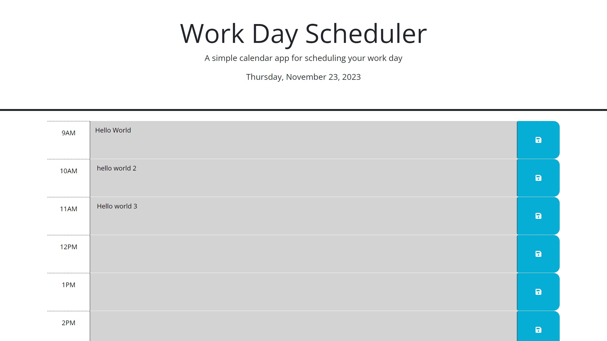

# Workday Scheduler

## Description

As a responsible web developer, I want to schedule my workday before starting my day to meet all deadlines. 
This challenge I was given HTML and CSS that needed JavaScript to provide functionality as each hour passes by during a normal workday. 
As the work day passes the website will show what task needs to be started on that hour in red and the website will show green for upcoming tasks/events. 

## Table of Contents

- [Installation](#installation)
- [Usage](#usage)
- [License](#license)
- [Contribution](#contribution)
- [Future Development](#future-development)

## Installation

Node packages weren't used in this project, so no installation is required. 

## Usage

To use the application, all you need is to input you task, habit, event etc, based on what time you want it to start. The text within the middle columns will be saved and the colored columns as time passed by will be shown. 

## License

This is free and unencumbered software released into the public domain.

Anyone is free to copy, modify, publish, use, compile, sell, or
distribute this software, either in source code form or as a compiled
binary, for any purpose, commercial or non-commercial, and by any
means.

In jurisdictions that recognize copyright laws, the author or authors
of this software dedicate any and all copyright interest in the
software to the public domain. We make this dedication for the benefit
of the public at large and to the detriment of our heirs and
successors. We intend this dedication to be an overt act of
relinquishment in perpetuity of all present and future rights to this
software under copyright law.

THE SOFTWARE IS PROVIDED "AS IS", WITHOUT WARRANTY OF ANY KIND,
EXPRESS OR IMPLIED, INCLUDING BUT NOT LIMITED TO THE WARRANTIES OF
MERCHANTABILITY, FITNESS FOR A PARTICULAR PURPOSE AND NONINFRINGEMENT.
IN NO EVENT SHALL THE AUTHORS BE LIABLE FOR ANY CLAIM, DAMAGES OR
OTHER LIABILITY, WHETHER IN AN ACTION OF CONTRACT, TORT OR OTHERWISE,
ARISING FROM, OUT OF OR IN CONNECTION WITH THE SOFTWARE OR THE USE OR
OTHER DEALINGS IN THE SOFTWARE.

For more information, please refer to <https://unlicense.org>

## Contribution

Best way to contribute will be to comment on the code to suggest how this application can be improved and collaborate to create a seemless app to improve upon.

## Future Development

Be able to display time in the middle of the screen. 
Being able to save previous tasks, save tasks to file.
Have the ability to delete tasks in middle column to start a new scheduler on the next day. 
Incorporate a tick box indicating that the task was completed. 